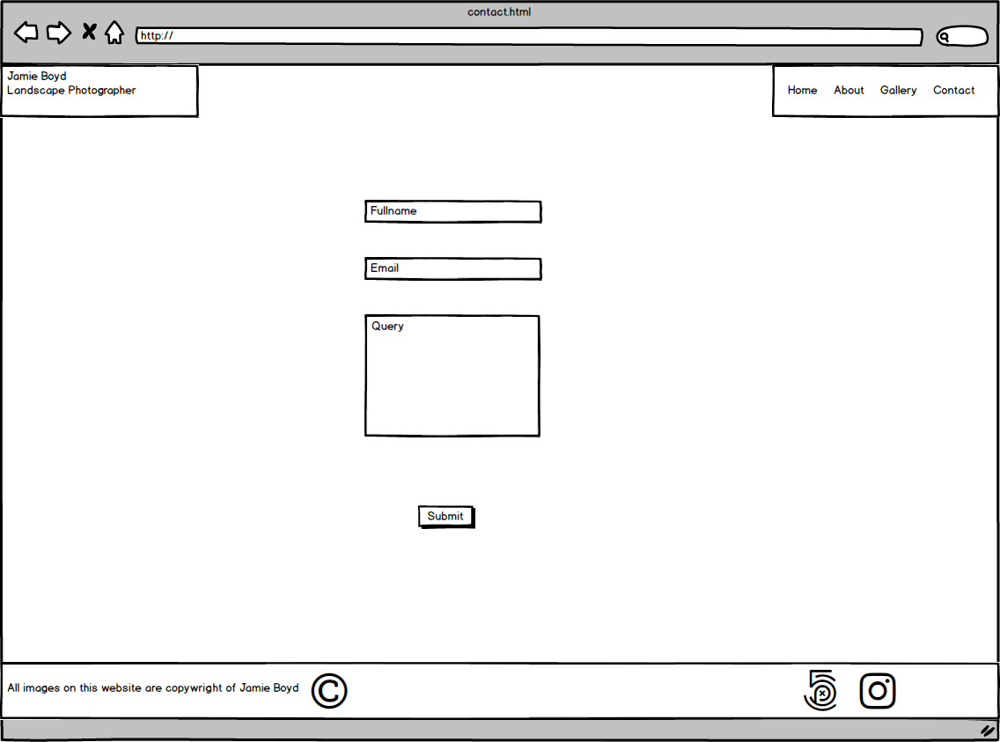

# Milestone Project 1
## Description
---
This is my first milestone project on the Full Stack Web Developer Code Institute course. The aim is to create a responsive, mobile first approach website, using the HTML and CSS that I have learnt so far. We were allowed to use CSS frameworks such as Bootstrap as long as it was documented. I was given a brief of a project or could choose to do my own if my mentor beleived if would satify all the required criteria. The scope of the projct does not include any back-end functionality, so whilst there is a form on my page, information entered into the fields will not feed anywhere.

I chose to pick my own project as I liked the idea of creating something unique. I am a keen photographer in my spare time. This brought me the idea to create a beautifully designed photography website where I could showcase my work. The website would serve as a place whereby users can come and visit my website to view my portfolio.

## UX
---

I wanted to ensure the design was a sleek and simple design, almost minimalist. I wanted my images to be the main focal point of the website. This is why I decided to go with a full page image for the landing page. I didn't want this to be cluttered with anymore information other than what was required. The Gallery page would be the next most important as this would be where a user will go to view my images. Again, I wanted to draw the users eye towards the images. My initial design was just to have images side by side with no text. However, when building the site I was notified of the "cards" component in Bootstrap and decided that would be how I would set out my gallery. This way I could also provide the tech specs of how the image was shot which other photographers may be interested to see. I added a button to the cards so that the image can be displayed full size. I chose to have them pop out into a seperate tab because I wanted the images to be displayed full size. Additionally, aheving them pop out onto the screen would have required Javascript.

The About and Contact pages were going to be the two most simple pages on my site. The contact page would just be a place where users could reach out to me with various queries. It would just contain a contact form, consisting of a filed for the users full name, email and query detail. Similarly with the About page, this would just be split into two columns at desktop level, and one column at mobile level. The first column would contain a picture of myself and the second column would be where I would provide text.

In terms of keeping my website repititive and easy to learn, I wanted to ensure the navigation remianed in the same place where possible (it would fall into a collapsible button at mobile level). I wanted to ensure all my pages followed the same structure and color theme throughout the site with the exception of my landing page, due to the fact the background image would be full size.

I chose Roboto and Lato as my fonts because I wanted to create quire a relaxed feel to the page. With photography being an art, I didnt want the font to feel too 'corporate like'. This also factored into my decision when choosing the color scheme. I wanted to keep it very nuetral and not too 'in your face' with any bright bold colors. This is why I kept the background white with the exception of the landing page.

Ultimately, I am a major photography fan, and I want the user to get a feel for that. The images on the website should be the most prominent feature and everything else should be as subtle as possible.

Below are pictures of my wireframes that I created prior to development. My wireframes were just a bare bones design. As Development progressed a made various changes as to what I thought looked better etc. But I used the wireframes initially to transform the idea.

### index.html

### about.html

### gallery.html

### contact.html

## Features
---
#### Current Features
* About Me - A page whereby user can go to learn a little bit more about me.
* Gallery - A page to view my a small version of my images, with the option to open up a larger image.
* Contact - A form so that users can get in touch with any queries or to collaborate.

#### Future Features
* Store - A store would be a great addition to the website to allow users to purchase images without having to contact me directly.

## Technologies/Support Used
---
Below is a list of technologies I have used to build out my site.
* HTML5 - HTML5 provided the content and the structure of my website. I tried to use semantic elements where possible to ensure the best structure.
* CSS3 - CSS was used to style my pages.
* [Bootstrap](https://getbootstrap.com/) - I used the Bootstrap framework alot during development. It was an efficeint way of creating the desired layout for my website. It also provided me with the possibilty to use ready made code for some parts of my website, such as the Nav bar and the contact form. I used Bootstrap to assist in building a Mobile-first approach website.
* VSCode - This is my text editor. It has a built in terminal so I could do everything I needed to from one environment.
* Git - Git was used for version control. Allowing me to create backups whenever significant changes were made to my code.
* [GitHub](https://github.com/) - This is where my repository is held externally. I will aslo use GitHub pages to deploy my website.
* Javascript/JQuery - This was imported via the Bootstrap framework to enable me to create a responsive collapsible nav bar at smaller screen sizes.
* [Google Fonts](https://fonts.google.com/) - Used to import specific fonts I wanted to use on my website.
* [Font Awesome](https://fontawesome.com/) - Used website to impor icons for my social links.
* [HTML Color Code](https://htmlcolorcodes.com/) - Used this website in order to obtain hex codes whilst styling my pages.
* [CSS:Hover](https://ianlunn.github.io/Hover/) - Used to import some cool animations used when hovered over a link.
* [Clip Art Mag](http://clipartmag.com/) - Used this free website to get the favicon for my website.
* Balsamiq - Used to build out wireframes for my website.
* [W3C Validator](https://www.w3.org/) - A validator used to check my HTML and CSS structure and format periodically throughout the build.
* [W3Schools](https://www.w3schools.com/) - I used this to ensure I was entering all the information required correctly in my HTML and CSS.

## Testing
---
I have both manually and automatically tested the website throughout the development of the project. I used the web developer tools consistenly to ensure my website was responsive, firstly at mobile screen sizes, and then at larger screen sizes. I used the device feature of dev tools to test the build on all devices available.
The automatic checks of my HTML and CSS structure were done in [W3C Validator](https://www.w3.org/) to ensure there were no errors and they were both structured correctly. I did this continuously throughout the process. Additionally, to ensure that my website was responsive across different browsers, I downloaded other browsers onto my machine so I could test the build in those too. My default browser is Google Chrome which is where I did the majority of my tests. I find this the best tool to use when developing a website as I can refer to the developer tools when required. I also tested the build on Safari, Firefox, IE, Edge and Opera, although these were done periodically. Currently, the website appears and fuctions exactly as it should on all browsers, with the exception of IE and Edge (see bugs section for more details).

If there was an error on my page, I would first change the styles etc in the dev tools so i could see a live update in the browser. Once I had figured out the issue I would then go back to VS Code and make the changes there. I also tried to commit my changes as much as possible. Like the testing I did this on an ongoing basis throughout development to ensure I had lots of versions, and I could go back to a previous version should a major error occur.

Additionally to the above, I also provided my GitHub pages link to various people in order to rigorously test the website, both on mobile and desktop. I had users click on all the links in the nav on every page, and also click on all the links to the full size images on the Gallery page. Users were also asked to enter information into the contact form and ensure they were prompted to enter information into every field, as was designed with the 'required' attribute. I also posted the link to my website in the Slack to get feedback from other students in the community.

#### Bugs

During the testing of the build I discovered that content wasnt appearing exactly as it should on both IE and Edge. I continued to build out my site whilst researching simultaneously what could be done to fix the issues I was encountering. Unfortunately, I have not been able to find any form of fix for IE. This has resulted in the gallery page not displaying any images, or any sort of format for that matter. With Edge, the gallery page isn't centered and again, I've not been able to find a fix for this yet. I beleive there is a way to target a specific browser in CSS however I've not been able to find anything yet that rectifys the issue. More research is required to rectify both of these issues. 

## Deployment
---
My website was created using VSCode. VSCode is a text editor with a built in terminal. I chose to use a text editor/IDE outside of AWS Cloud9 to gain experience working outside of a browser. Once I had created my file strcuture and first HTML page, i initiated a local repository using GIT which was downloaded onto my machine previously. I then created an external repository in GitHub and linked the local and external repositories. This allowed me to version control throughout the lifespan of the development.

To deploy the website to GitHub pages, I followed the below steps:
* Selected the milestone-project-1 from my GitHub dashboard.
* Selected 'Settings' from the menu bar.
* From the GitHub pages section, I chose 'master branch' from the dropdown menu.
* Once selected, the page refreshed and a link was displayed in the GitHub pages section to my wesbite.
* [Website Link](https://jboyd8.github.io/milestone-project-1/)

## Credits
---
* To my mentor, Reuben Ferrante, for guding me through the process and offering assistance when neccesary to point me in the right direction.
* The Slack community. The help a student is able to receive from the other students is a really great tool to have.
* Anthony O'Brian and Anna Greaves. The two leads in the User Centric Front End Slack channel during the development of my project. They provide alot of people with good quality help on a daily basis. Additionally, some of Anna's extra documentation that she has created herself came in very useful before and during development.

#### Copied Code
As stated in the technologies used section, I used various websites to import animations and fonts etc. However, I explicitly copied code from Bootsrap for my Nav Bar and the Card Decks on the Gallery page.